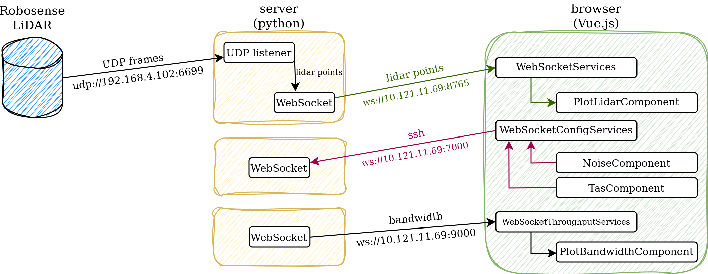

# TSNavig8 - Demo: Interactive Off-the-Shelf In-Car TSN Testbed
The described software is presented in the paper ***"Demo: Interactive Off-the-Shelf In-Car TSN Testbed"***, accepted for publication in the IEEE Vehicular Networking Conference (VNC 2024).
## Abstract
TSNavig8 represents an interactive and affordable Time-Sensitive Networking (TSN) testbed built using off-the-shelf hardware. It provides a user-friendly interface for configuring an in-car TSN testbed and experiencing real-time interactions, such as assessing the impact of background noise traffic on automotive LiDAR sensor data, with support for configuring the IEEE 802.1Qbv standard.

## License
© 2024 - Luxembourg Institute of Science and Technology. All Rights Reserved
This program is licensed under AGPL V3.0 License. Please consult the LICENSE file.

## Requirements

* Python 3.11, with the following library
    * python-websocket-server v0.6.4

* Node.js >= 18.3 
* JavaScript es6, with the following libraries?
    * Three.js v0.162.0
    * Chart.js v3.9.1
    * chartjs-plugin-streaming v2.0.0
    * Bootstrap v5.3.3
    * Bootstrap icons v1.11.3

## Installation
Clone the repository

```bash
git clone ['link to git repository']
```

Install Dependencies
``` npm install ```

### Project setup
1. Run the Python server
```bash
cd backend
mkdir logs
python3 server.py
python3 throughput_server.py
python3 config_server.py
```

2. Compiles and hot-reloads the client app for development
```bash
npm run serve
```

You can access the application on: http://localhost:8080


## Architecture



## Project structure
* **backend** folder
    
    This folder contains the following Python files:
   
    * `server.py` - Python server that listens on UDP port 6699 where MSOP packets are sent from the LiDAR. This UDP listener processes the payload of the datagrams and converts the polar coordinates (angle and distance) to Cartesian coordinates. Once completed, the messages containing the `⟨x, y, z, distance⟩` are sent to the web client application. The distance measured in centimeters is used to compute the color of each point.

    * `throughput_server.py` - Python server  responsible for computing the real-time bandwidth utilization every second and sending this data to the web client application.

    * `config_server.py` - Python server  used to perform hardware configuration over the Secure Shell (SSH) protocol based on input parameters provided by the user.

* **backend/tas_configs/bridge20** folder
    
    * This folder contains examples of Time-Aware Shaper configuration files for ```RELY-TSN-Bridge v20.1.11```.

* **backend/tas_configs/bridge22** folder

    * This folder contains examples of Time-Aware Shaper configuration files for ```RELY-TSN-Bridge v22.3.0```.


* **src/components** folder 
This folder contins the following components:
    * `PlotBandwidthComponent.vue` - uses *Chart.js* to plot the bandwidth utilization measured in Mbit/s.
    
    * `PlotLidarComponent.vue` - uses *Three.js* library to render cloud points, allowing the user to visualize scanned data from the LiDAR sensor.
    
    * ` NoiseComponent.vue ` - enables the user to configure the *size* of the ethernet frame , *Priority Code Point (PCP)* and *bandwidth usage* in percentage units of the traffic sent by the **RELY-TRAF-GEN v20.1.0**.
    
    * ` TasComponent.vue ` - enables the user to configure the Time-Aware Shaper TAS configuration by specifying the number of slots,their duration, and which priority queues are enabled.
    Example of TAS configuration files are presented in **backend/tas_configs/** folder.

    * `FooterComponent.vue` - this component represents the footer section of the application.

    * `HeaderComponent.vue` - this component represents the header section of the application.
    
    * `MainComponent.vue` - this component represents the main content area of the application.

## Acknowledgements
If you utilize this code, we kindly ask that you refer to the following publication:
```tex
@inproceedings{andronovici2024interactive,
  author = {Andronovici, Darinela and Nicolas, Damien and Turcanu, Ion and Sommer, Christoph},
  title = {{Demo: Interactive Off-the-Shelf In-Car TSN Testbed}},
  booktitle = {15th IEEE Vehicular Networking Conference (VNC 2024)},
  address = {Kobe, Japan},
  month = {May},
  note = {to appear},
  publisher = {IEEE},
  year = {2024},
}
```

## Contact
For inquiries, assistance, or further information, please feel free to reach out to:
* Damien NICOLAS at damien.nicolas@list.lu
* Ion TURCANU at ion.turcanu@list.lu